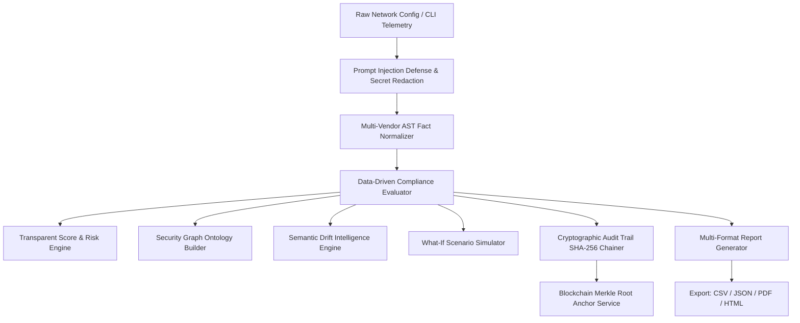

# Cipher-X System Architecture & Technical Specifications

## 1. High-Level Architecture

Cipher-X is designed with a decoupled, high-assurance architecture separating passive telemetry ingestion, deterministic Abstract Syntax Tree (AST) fact normalization, regulatory rule evaluation, ontology graph construction, and cryptographic verification.

---

## 2. Core Subsystems

### A. Data-Driven Compliance Engine (`backend/app/compliance_engine/`)
- **Decoupled Architecture**: Rules and frameworks are stored in pure JSON definitions (`rules/`, `frameworks/`, `vendor_packs/`).
- **Loader**: Dynamically discovers and registers new regulatory frameworks or vendor packs at runtime without code changes.
- **AST Fact Extraction**: Normalizes device-specific syntax (e.g. `set system services ssh` in Junos vs `ip ssh version 2` in Cisco vs `set admin-ssh-v1 disable` in Fortinet) into normalized parameter keys (`ssh.version`, `telnet.enabled`, `snmp.has_default_community`).

### B. Security Knowledge Graph (`backend/app/services/security_graph.py`)
Modeled as an acyclic directed graph with formal entity ontology:
- `Device` node: `(id, name, vendor, risk_score, compliance_score)`
- `Configuration` node: `(id, version, byte_size, hash)`
- `Fact` node: `(key, value, line_number)`
- `Control` node: `(id, title, severity, category)`
- `Finding` node: `(status, risk_score, explanation)`
- `Risk` node: `(severity, weight)`
- `Remediation` node: `(objective, commands, verify, rollback)`

Edges: `HAS_CONFIGURATION`, `EXTRACTED_FACT`, `EVALUATES_FACT`, `GENERATES_FINDING`, `POSES_RISK`, `RESOLVED_BY`.

### C. Semantic Drift Intelligence (`backend/app/services/drift_intelligence.py`)
- Distinguishes **cosmetic modifications** (e.g., interface description changes, banner comment edits) from **security-relevant drift** (e.g., Telnet enabled, 3DES added to cipher suites, remote syslog disabled).
- Computes compliance score deltas ($+\Delta$ or $-\Delta$) and risk score shifts.

### D. Cryptographic Audit Trail & Blockchain Anchoring (`backend/app/services/audit_integrity.py` & `blockchain_anchor.py`)
- Chained audit record:
  $$\text{Hash}(Event_n) = \text{SHA256}(Event_n.\text{Payload} + \text{Hash}(Event_{n-1}))$$
- **Verification Engine**: Traverses the chain from Genesis block to the tip, recomputing all intermediary hashes to guarantee zero retroactive tampering.
- **Blockchain Anchoring**: Generates Merkle root proofs and transaction receipts simulating on-chain anchor records. Raw configuration text is **never** uploaded onto ledgers; only cryptographic SHA-256 hashes and non-sensitive metadata are anchored.
